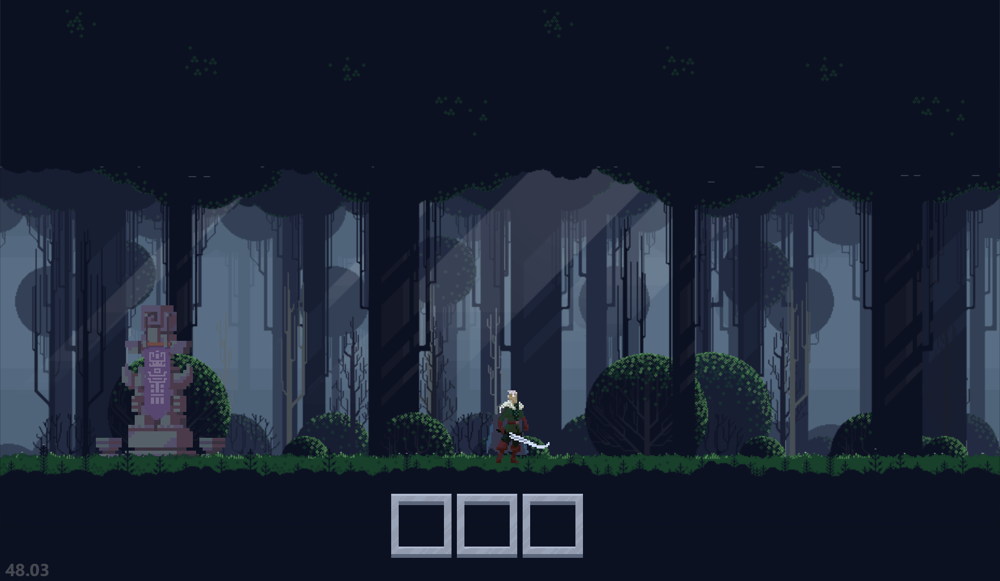
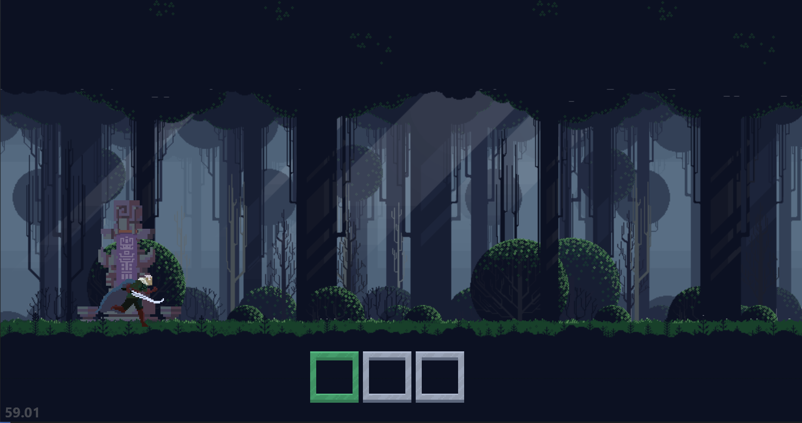

# 🤺 UltraKnight Game

Game is in development and considering that is project to improve skills and learn new technologies there wont be any huge progress. My purpose was to learn [Pyglet](https://pyglet.readthedocs.io/en/latest/index.html) that efforts OpenGL wrappers to use in Python. Game is hardcoded and has a little chaotic stracture. I also used already made game assets: [Free Pixel Art Forest](https://edermunizz.itch.io/free-pixel-art-forest), and other (will add later).

#### Screenshots of gameplay:

